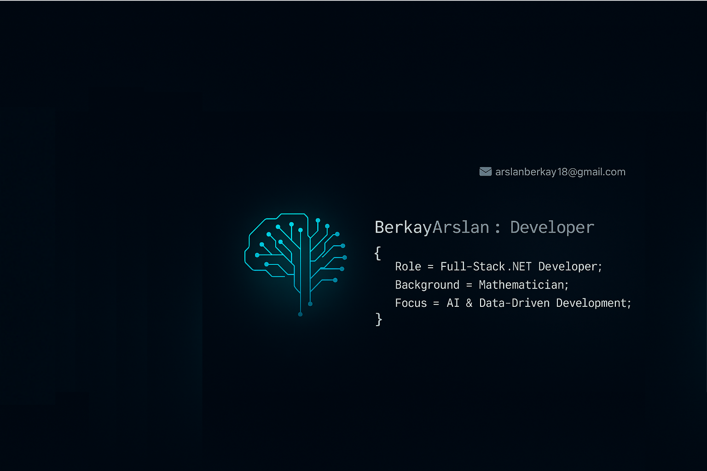

  

<h3 align="center" style="color:#C0C0C0;">💻 Full-Stack .NET Developer | 🎓 Gazi Matematik Bölüm Birincisi (GNO: 3.41)</h3>

Gazi Üniversitesi Matematik Bölümü’nü bölüm birincisi olarak tamamladım. Matematik eğitimi bana analitik düşünme, problem çözme, sabır ve disiplinli çalışma alışkanlıkları kazandırdı. Bu güçlü temeli yazılım dünyasında kullanarak öğrenmeye ve üretmeye devam ediyorum.  
Yeni teknolojilere hızla adapte olabilen, takım çalışmasına yatkın, gelişime açık ve çözüm odaklı bir yazılım geliştiricisiyim. Hedefim, sahip olduğum analitik bakış açısını modern yazılım teknolojileriyle birleştirerek değer üreten projelere imza atmaktır.  
Ayrıca, şu anda Boğaziçi Üniversitesi, ODTÜ, İTÜ ve Marmara Üniversitesi katkılarıyla yürütülen Yapay Zeka eğitimine katılarak kendimi bu alanda da geliştirmekteyim.

---

<h2 align="left">🛠️ Kullandığım Teknolojiler</h2>

<h3>⚙️ Programlama Dilleri</h3>

  

<h3>🗄️ Veritabanı Teknolojileri </h3>

  
  
   
  

<h3>🔧 Araçlar & Platformlar </h3>

  
   
  

<h3>🌐 Teknolojiler ve Uygulama Çatıları </h3>

  
   
  
  
  
  
  
  
  
  
  
  

<h3>⚙️ Yazılım Mimarisi & Tasarım </h3>

  
  
  
  
  
  
  
  

<h3> 🗄️ Kütüphaneler & Test </h3>

  
  
  
  
  
  
  
  

---

<h2 align="center">📬 Bana Ulaşın</h2>

  
  
  

